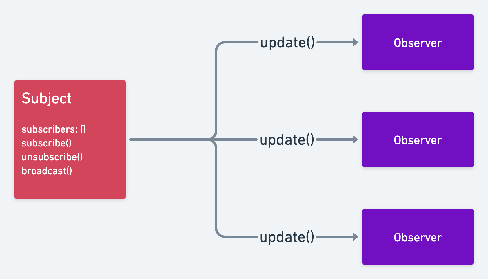

# Observer pattern

## What is it?
* An object (the subject) maintains a list of dependents (observers) and notifies them when state changes, usually by calling a broadcast method
* [EventTarget.addEventListener()](https://developer.mozilla.org/en-US/docs/Web/API/EventTarget/addEventListener) is an example of the observer pattern
* [RxJS](https://rxjs.dev/guide/observable) uses observables 

## Video structure
1. Building an observable with a class
2. Using observables
3. Building an observable with a function
4. Practical example