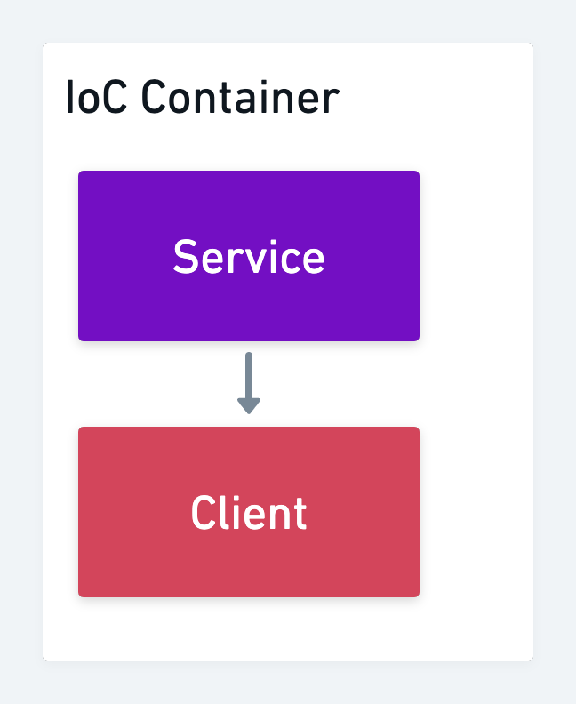

# Dependency injection

## What is it?
A strategy where an object has it's dependencies injected into it. The receiving object is called the client and the object that is injected is called the service.

In simpler terms, dependency injection is passing something that the client depends on in as arguments, instead of either building the service itself, or getting it from the global scope.

## Why
* Separation of concerns - Separates the construction and use a service
* Reusability - Services created outside of the client can be used anywhere
* Testing - A mocked service can easily be injected into the client during tests

## Why not
* Can be more work
* Can be just as simple to construct the service in the client
* Might move the logic to build services somewhere that's harder to manage

## Video structure
1. Simple example
2. Dependency injection in NestJS