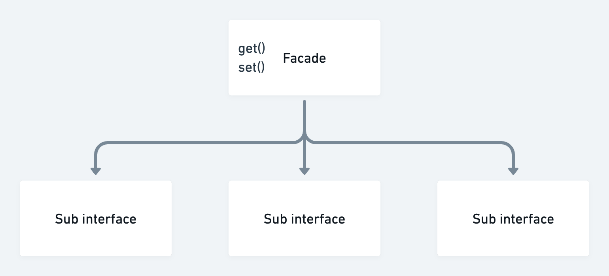

# Facade pattern

A facade pattern is analogous to a facade in architecture, it is pretty on the outside and hides underlying complexity

## Why use a facade pattern?
* Masks complexity of underlying code
* Provides a single interface to a set of interfaces
* Can help make complex code more context specific

## Why not use a facade pattern?
* Facades can become "God objects" that are too complex to use

## Examples of a facade pattern
* Backend for frontend (BFF) layer - Join multiple services together to server a UI
* An external-facing API - Make a complex internal API more user-friendly with a facade